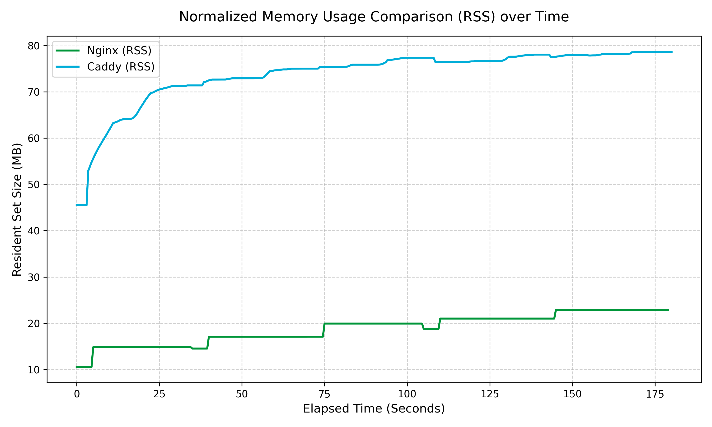

# HTTP CONNECT Stress tests

Run `make` to build targets.
There are 3 binaries:

- echoserver
- stresstest
- watcher

Run `<bin name> -h` to see usage.

Tests are constructed as following:
1. EchoServer returns back the exact same data
2. stresstest send packets via proxy
3. Log down each RTT time.
4. Echo server can take a flag: `-delay`, used to reveal proxy server
   behaviour under back pressure.
5. watcher takes in a PID, and monitor these: `timestamp,vm_rss_kb,vm_size_kb`
6. `tools/plotter.py` plots out the memory comparison

## Real tests. Caddy vs Nginx



* [Caddy forward proxy](https://github.com/caddyserver/forwardproxy)

* [Nginx tunnel module](https://github.com/ZihaoFU245/ngx_http_tunnel_module)

* stresstest commands used[^1]

* Caddy build with `xcaddy build --with github.com/caddyserver/forwardproxy`

* Nginx builded with[^2]

* Tested on intel i7-14650HX


## Additional test details

For Nginx

```txt
Starting stress test
  Tunnels:   100
  Rate:      1.00 Mbps per tunnel
  Duration:  30s
  Proxy:     127.0.0.1:3128
  Target:    127.0.0.1:8080
  Transport: HTTP/2
  Mode:      single TCP connection (h2 multiplex)


═══════════════════════════════════════════════════════════
  HTTP/2 CONNECT TUNNEL STRESS TEST REPORT
═══════════════════════════════════════════════════════════

  Tunnels:   100
  Duration:  29.994684746s
  Samples:   266058
  Errors:    0

  Bytes Sent:  357.3 MB
  Bytes Recv:  357.3 MB
  Throughput:  99.91 Mbps

  ─────────── Latency (ms) ───────────

  Min:  0.025
  Max:  2.553
  Avg:  0.456
  P50:  0.421
  P95:  0.903
  P98:  1.100
  P99:  1.200

  Tail 5% Avg:       1.081
  Tail 2% Avg:       1.247
  Latency Variance:  0.258

═══════════════════════════════════════════════════════════
```

For Caddy server

```txt
Starting stress test

  Tunnels:   100

  Rate:      1.00 Mbps per tunnel

  Duration:  30s

  Proxy:     127.0.0.1:3128

  Target:    127.0.0.1:8080

  Transport: HTTP/2

  Mode:      single TCP connection (h2 multiplex)


═══════════════════════════════════════════════════════════

  HTTP/2 CONNECT TUNNEL STRESS TEST REPORT

═══════════════════════════════════════════════════════════


  Tunnels:   100

  Duration:  29.987202117s

  Samples:   265866

  Errors:    0


  Bytes Sent:  357.0 MB

  Bytes Recv:  357.0 MB

  Throughput:  99.87 Mbps


  ─────────── Latency (ms) ───────────


  Min:  0.036

  Max:  2.436

  Avg:  0.333

  P50:  0.293

  P95:  0.627

  P98:  0.718

  P99:  0.778


  Tail 5% Avg:       0.727

  Tail 2% Avg:       0.818

  Latency Variance:  0.147


═══════════════════════════════════════════════════════════
```

*Both are runned seperatly from start, all software is killed before retested.*

---

[^1]: Stress test commands used see below

    ```fish
    #!/usr/bin/fish

    for i in (seq 5)
        echo "========================================="
        echo "Starting stress test run $i of 5..."
        echo "========================================="
        
        # Run the stress test
        ./stresstest -d 30s -k 100 -m 1 --h2-multiplex

        # Rest for 5 seconds between runs, except after the final run
        if test $i -lt 5
            echo "Run $i complete. Resting for 5 seconds..."
            sleep 5
        end
    end

    echo "All 5 stress test runs completed!"
    ```

[^2]: Nginx build flag

    ```txt
    nginx version: nginx/1.31.1
    built by gcc 15.2.0 (Ubuntu 15.2.0-16ubuntu1) 
    built with OpenSSL 3.5.5 27 Jan 2026
    TLS SNI support enabled
    configure arguments: --prefix=/home/zihao/Projects/nginx-src/tests --sbin-path=/home/zihao/Projects/nginx-src/tests/sbin/nginx --conf-path=/home/zihao/Projects/nginx-src/tests/conf/nginx.conf --pid-path=/home/zihao/Projects/nginx-src/tests/run/nginx.pid --lock-path=/home/zihao/Projects/nginx-src/tests/run/nginx.lock --error-log-path=/home/zihao/Projects/nginx-src/tests/logs/error.log --http-log-path=/home/zihao/Projects/nginx-src/tests/logs/access.log --http-client-body-temp-path=/home/zihao/Projects/nginx-src/tests/temp/body --http-fastcgi-temp-path=/home/zihao/Projects/nginx-src/tests/temp/fastcgi --http-proxy-temp-path=/home/zihao/Projects/nginx-src/tests/temp/proxy --http-scgi-temp-path=/home/zihao/Projects/nginx-src/tests/temp/scgi --http-uwsgi-temp-path=/home/zihao/Projects/nginx-src/tests/temp/uwsgi --with-compat --with-threads --with-file-aio --with-pcre-jit --with-http_ssl_module --with-http_v2_module --with-http_v3_module --with-http_realip_module --with-http_auth_request_module --with-http_stub_status_module --with-http_slice_module --with-http_addition_module --with-http_sub_module --with-http_dav_module --with-http_flv_module --with-http_mp4_module --with-http_gunzip_module --with-http_gzip_static_module --with-http_random_index_module --with-http_secure_link_module --with-stream --with-stream_ssl_module --with-stream_ssl_preread_module --with-cc-opt='-g -O2 -fPIC -fstack-protector-strong -Wformat -Werror=format-security -D_FORTIFY_SOURCE=3' --with-ld-opt='-Wl,-z,relro -Wl,-z,now -fPIC' --add-module=../ngx_http_tunnel_module
    ```
